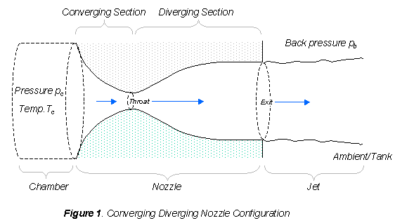

## Calorically perfect air CV nozzle simulation

Run: `python calculate.py [A*] [A/A*] [initial mass] [0 | 1]`
Last 0 or 1 param specifies if the following graphs are generated:
- `Acceleration = f(t)`
- `Velocity = f(t)`
- `Height = f(t)`
- `Thrust = f(t)`
- `Drag = f(t)`
## Explicações beca beca
This script simulates a rocket powered by perfect air (γ=1.4) with the following input parameters:
- Critical Area (= area at throat) [m2] -> `A*`
- Area Ratio -> `A/A*`
- Rocket Mass

  
The frontal area considered for drag calculations is equal to the nozzle exit area.

Stagnation pressure (P0) and temperature (T0) may also be specified by editing the script file.

## Opt.py
Runs several iterations looking for the combination that produces the highest flying rocket.
